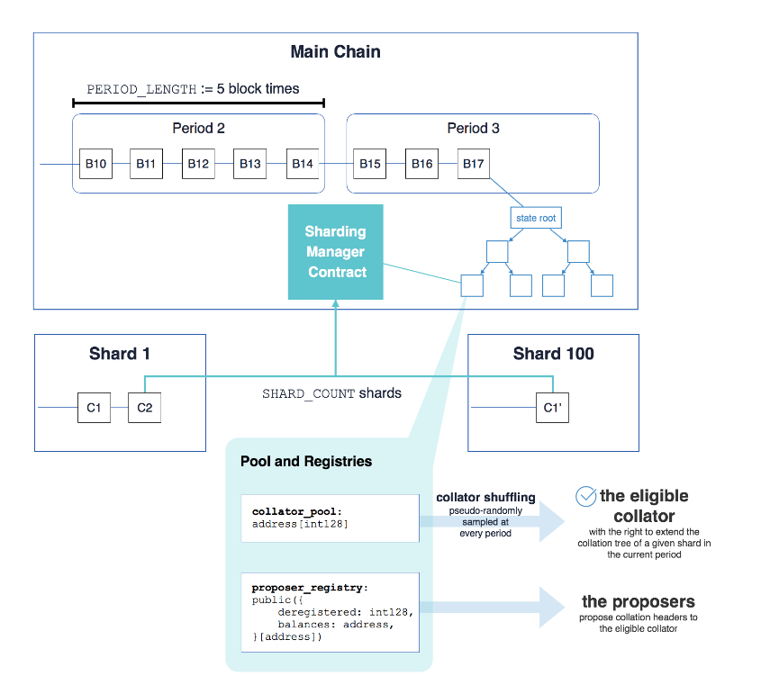
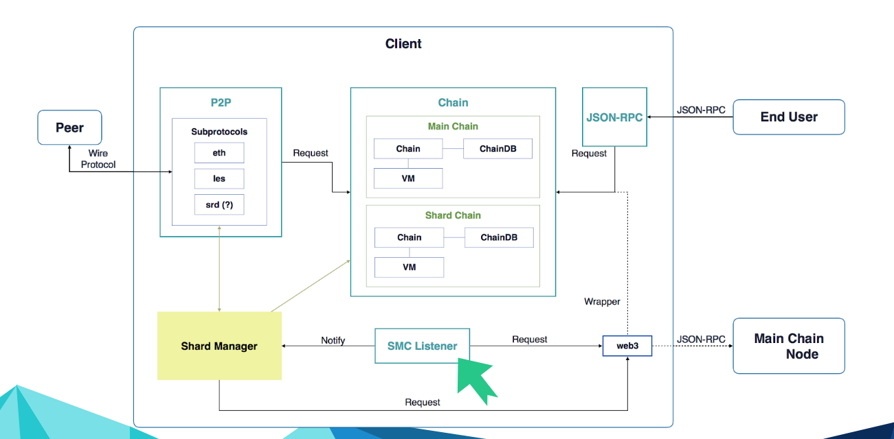

### 以太坊的分片技术
[官方资料](https://github.com/ethereum/wiki/wiki/Sharding-introduction-R&D-compendium)

##### 目标
1. Scaling: 可伸缩性，即性能能够达到VISA水平，千级TPS
2. 可用性：
   - 跨智能合约交易
   - 跨片交易
3. 紧耦合

##### Collation——校对数据结构
Collation Header
- shard_id: the Shard ID of shards, most like a network-id, from 0~N-1(N is shard number).
- parent_hash: the hash of parent collation.
- chunk_root: 类似于默克尔树root的一个字段，是对body里面的chunks的root.
- period（周期）: 进行校对的周期. (主链上五个区块算一个周期)
- proposer_bid: 该collation的提案人的地址.
- proposer_signature: 提案人的签名.

Collation Body
- chunks: list-chunks

#### 整体概览
两层和三个步骤：
- 第一层
  - 提案人(Proposer)收集交易放入到Collations中
  - 校对人(Collator校对
    - a: 链接Collations
    - b: 同意规范链
- 第二层
  - 执行人(Executor)
    - a: 处理交易
    - b: 执行智能合约
    - c: 计算状态

##### Proposer
1. 任何人都可以成为Proposer
2. 运行管理一个交易池
3. 收集所有的交易进行打包
4. 发送和接收Collation Body

##### Collator
1. 被伪随机抽样为来自所有碎片的整理池的“特定碎片和特定时期”的合格的整理者
2. 整理提案来构建排序规则

##### Executor
1. 执行状态转换功能
2. 提议者最好也应该是执行者，这样可以知道交易的消耗的gas，并选择费用高的交易

#### Sharding Manager Contract（SMC）

#### 执行流程
1. 验证者通过查看LOOKHEAD, 就是先前的区块链信息去判别接下来的验证者身份
2. 普通用户提交交易到proposer
3. proposer打包出collations并分一些gas去给验证者
4. 验证者传输接收潜在的collations
5. 验证验证直到一定的深度的片段
6. 验证者提交所验证的片段的深度给root chain
7. 恶意的验证者会提交一个非法的collation
8. 下一阶段的验证将在此分叉处处理这个非法的collation, 选取前一个合法的collation提交给root chain

#### 分片方案与现有架构的整合图

### Sharding FAQ
##### 三个简单的实现扩容的方案
1. 不再使用单一的链结构。但是这样会加多N-因子，导致安全性的下降
2. 提高区块的大小。但是这种方案将导致很多弱连接的节点下线，最终成为集中式的中心化结局
3. 联合挖矿。所有的矿工一起挖，共享收益，但是这种方式将导致矿工的成本增加，原理上还是和提高区块大小一样

##### 扩展性的难题
1. Decentralization（分散化）。任何设备接入并且只都能提供O(c)的资源
2. Scalability（可扩展性）。能够处理O(n) > O(c)的交易
3. Security（安全性）。能够抵御O(n)资源的攻击

c指单节点能够提供的有效资源(计算，带宽，存储)，n指整个生态的规模，交易负载，存储状态大小，数字货币价值都与n成正比。

#### What are some moderately simple but only partial ways of solving the scalability problem ? 什么是解决可伸缩性问题的一些中等简单但仅部分的方法？
早期的分片思想和后来的Zilliqa, Merklix tree都是在使用分片或者碎片技术来解决吞吐量的问题，主要用于解决交易吞吐量的问题，但是没有考虑存储的代价。要全面解决这些问题，还需要解决状态存储，事务执行和广播机制都全面调整。需要深入到P2P层。早期的一个分片方案[ELASTICO](https://www.comp.nus.edu.sg/%7Eloiluu/papers/elastico.pdf)。

#### 并没有走分片路线的其他方法？
1. 用拜占庭协议去改造区块链共识形态: Bitcoin-NG
2. 使用外部通道和off-chain加速: Lightning Network，Raiden
3. 使用密码学来改造： Mimblewimble，zk-SNARKs

#### 术语
- State: 当前的状态，可以判别是否有效。比如Bitcoin中的UTXO，Ethereum中balance+nonce+code+storage，Namecoin中的域名注册表
- History: 自从传世交易以来的所有交易记录
- Transaction: 用户生成的含有签名的一个操作，有时候叫 blobs
- State transaction function: 是一个涉及操作状态的交易
- Merkle tree: 验证只需要 O(log(n))的一种存储数据的树形结构
- Receipt: 代表一个事物效果的对象，并不直接存储在State中，但是存储在Merkle中，用于表示记录的存在，便于以后查询和使用，比如Ethereum中的Logs就是Receipt
- Light client: 存储少量数据，用于Merkle判别的一种客户端实现
- State root: 状态的Merkle树

#### 分片的初始思想
我们将状态和历史分为 K=O(n/c) 分区，我们称之为“碎片”。例如，以太坊的分片方案可能会将所有以0x00开头的地址放入一个分片中，以0x01开头的地址放入另一个分片中。在最简单的分片形式中，每个分片也具有其自己的事务历史记录，某些分片k中的交易仅限于分片k的状态。一个简单的例子是多资产区块链，其中有K个分片，每个分片存储余额并处理与一个特定资产相关联的交易。在更高级的分片中，还包括某种形式的跨分片通信功能，其中一个分片上的事务可以触发其他分片上的事件。

#### 分片区块链的基本设计
一个简单的演示例子。为了简单，设计只存储数据点，不执行状态更改操作（UTXO）。存在一些叫做 collators 的节点分布在K分区中，负责接受blobs（transactions），并对这些交易进行打包操作成Collation，包括头，简短消息，上一个Collation和Merkle root。在每一个分区中，这都很想一条完整的区块链。现在的主链就是对这些一个个Collations的排序。一个分区K中的有效区块链，是指在主链上的所有K分区中的区块形成的那条最长链。因此在系统中存在几种节点。
- Super-full node - 下载所有分区和所有Collation, 进行所有验证操作。
- Top-level node - 处理所有主链区块，提供信息给其他的分片组。
- Single-shard node - 处理所有主链区块，并且处理该分区内的所有Collations。
- Light node - 下载主链的区块头。

Windback Verification——回溯验证。轻客户端通过下载最近的N（N=25）个Collation，来做有效性和可用性验证。

#### 面临的挑战有哪些？
- Single-shard takeover attacks —— 单分片占领攻击 => 一般采用随机选举算法抵御
- State transition execution —— 状态交易执行。（具有强同步的状态，保持所有Collator具有准确的状态）
- Fraud detection —— 欺诈识别
- Cross shard communication —— 分片交叉通信
- The data availability problem —— 数据可用性问题
- Superquadratic sharding —— 2次分片

#### 安全模型？
- Honest majority —— 大部分是诚实的
- Uncoordinated majority —— 大部分是理性的
- Coordinated choice —— 协调选择
- Bribing attacker model —— 贿赂型攻击者模型
