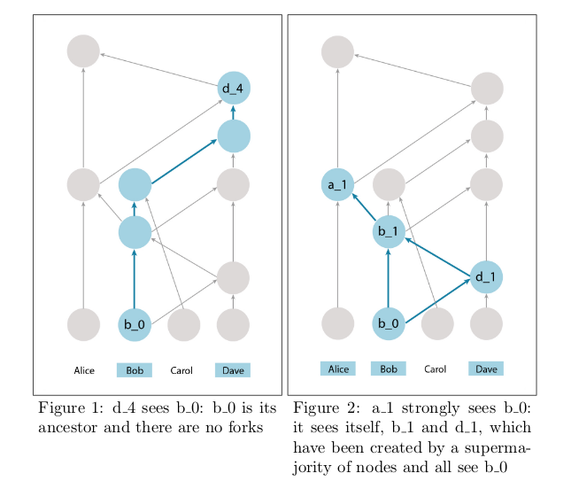

## Parsec 异步，可靠，安全和有效的共识算法
[原始论文](http://docs.maidsafe.net/Whitepapers/pdf/PARSEC.pdf)

## Protocol for Asynchronous, Reliable, Secure and Efficient Consensus (PARSEC)

### 简介
论文中主要论述了一种全新的拜占庭容错共识算法，通过弱同步来实现的。如同Hashgrap一样，没有leader，没有准备的轮，没有POW，并且达到最终的概率为1的共识。但是跟Hashgrap不同的是，它不仅提供一个非常高的速度，不管系统中是否出现容错。而且这是一个完全开放的，遵循GPLv3，采用Rusta实现。

跟HoneyBadeger BFT一样，这个算法建立在很多理论研究中的好的想法上。一个Gossip协议用来有效的在节点间沟通，如果Hashgrap和[Snowflake Avalanche]()一样. 传播消息，实际上达成共识只需要花费O(NlogN)通信和O(logN)阶段。

达到任意值的拜占庭协议的一般问题被简化为在参与每个决策的节点上达到二分拜占庭协议的更简单问题。 这允许我们在将其应用于Gossip协议之后重用[免签名的异步拜占庭]()中描述的优雅二进制拜占庭协议协议。

最后，在上面免签名的异步拜占庭中存在的可信领导者和可信步骤被替换为[异步协定]()中实现异步的设置。

### 算法详解
#### 网络模型
我们假设网络是通过随机同步连接进行通信的算法的N个实例的集合N. “随机同步”是指消息以随机延迟传递，使得平均延迟是有限的。特别是，可能存在任意长时间延迟的时期。这是一个比弱同步更弱的假设，并且只比完全异步强一点，其中唯一的保证是最终传递消息。

使用随机同步，就像完全异步一样，无法通过完全停止来判断实例是否已失败，或者消息传递只是延迟。

我们允许最多t拜占庭（任意）失败的可能性，其中3t <N。我們将调用未正确或诚实失败的实例，并且失败的实例有故障或恶意 - 因为拜占庭故障模型允许恶意行为和合作。

我们将引用任何包含超过2/3N的实例作为绝对多数。

#### 数据结构
一个节点保持着两种结构：gossip图和所有区块顺序。gossip图的顶点称为gossip事件(gossip event)，包含下面的字段：
- 有效负载(Payload) - 节点想要传过其他节点的数据
- 自身父项(Self-parent) - 指向自身节点的上一次区块的hash
- 其他父项(Other-parent) - 指向一个其他节点创建的区块的hash
- 原因(Cause) - 此事件的创建原因; 可以是请求，回应或观察
- 创建者ID(Creator ID) - 创建这个事件的创建者的公钥
- 签名(Signature) - 整体的签名

除了由各个节点创建的第一个事件之外，自父项和其他父项始终存在，因为在这种情况下不存在要引用的父事件。 由于观察而在创建的事件中也缺少其他父母 - 因为在这种情况下没有goosip伙伴。

有序集中的块是由网络中的节点的子集签名的网络事件。 该集合是算法的输出，表示所有节点都同意的网络事件的顺序。

我们还要定义一些关于gossip图的有用术语以供将来使用。

* Definition 2.1. We say that event A is an ancestor of event B iff: A=B, or A is an ancestor of B’s self-parent, or A is an ancestor of B’s other-parent.
* 定义 2.1. 我们说事件A是事件B的祖先，那么：A = B，或者A是B的自身父事件的祖先，或者A是B的其他父事件的祖先。

* Definition 2.2. We say that event A is a descendant of event B iff: B is an ancestor of A.
* 定义 2.2. 我们说事件A是事件B的后裔，那么：B是A的祖先。

* Definition 2.3. We say that event A is a strict ancestor/descendant of event B iff A is an ancestor/descendant of B and A != B.
* 定义2.3. 我们说事件A是事件B的严格祖先/后代，那么: A是B和A的祖先/后代，并且A != B.

* Definition 2.4. An event A is said to see an event B iff B is an ancestor of A, and there doesn’t exist any pair of events by B ’s creator B1, B2 , such that B1 and B2 are ancestors of A , but B1 is neither an ancestor nor a descendant of B2 (see fig. 1). We call a situation in which such a pair exists a fork.
* 定义2.4. 事件A能看到事件B，表现为事件B是A的祖先，并且B的创建者B1，B2不存在任何事件对，使得B1和B2是A的祖先，但B1是既不是B2的祖先也不是后代（见图1）。我们称这种情况下存在一个分叉的情况。

* Definition 2.5. An event A is said to strongly see an event B iff A sees a set of events created by a supermajority of nodes in the system that all see B (see fig. 2).
* 定义2.5. 事件A能够强烈的看到事件B，表现为A能够看到系统中绝大多数节点的事件都可以看到B。

#### 算法总览
在每一轮中，节点将执行两个主要步骤：
- 与随机的节点进行gossip图的同步
- 确定是否将任何的新块加入到有序集中

##### 同步
此步骤负责构建Gossip图,并在网络中传播信息。节点不断向其他节点发出称为同步请求的随机调用，并交换有关该图的信息，以便所有正确的节点在其图中以相同的数据结束。gossip事件中的哈希和签名可确保恶意节点无法篡改图表的任何部分。

每当节点收到同步请求时，它就会创建一个新的gossip事件并发回一个同步响应。此事件的自我父事件是收件人创建的最后一个gossip事件的哈希值，另一个父事件是发件人创建的最后一个事件的哈希值（收件人从交换中获知）。同步响应的收件人还会创建一个具有类似父项的新事件。创建的两个事件还存储创建它们的原因（无论是由于请求还是响应）。

如果请求/响应的接收者认为它知道应该作为链中的下一个附加的网络事件，则将其投票记录为新创建的事件的有效负载。其他节点将在其创建者进行的后续同步交换期间了解此投票。

##### 决定顺序
在这个阶段，节点将分析图，统计投票数来决定哪个区块将作为下一个区块，这个步骤是复杂的，所以在下面另开一章描述。

#### 计算顺序
为了对区块进行排序，我们首先得有一些区块。

如上所述，Gossip事件可能包含对网络中事件的投票。 看到由包含针对给定网络事件的投票的绝大多数节点创建的事件的gossip事件被称为有效块，并且我们将这种gossip事件称为块投票。强烈看到由绝大多数节点创建的块投票的第一个gossip事件被认为是观察者。块投票不需要看到相同的有效块 - 实际上，当它们看到最有趣的不同有效块时就是这种情况。但是，它们必须仅引用尚未附加到有序集的块。

观察者隐含地携带N个元投票的列表。每个元投票只是一个二进制值，表示在确定顺序时是否要考虑相应节点的块投票。观察者如果能够强烈地看到该节点的块投票，则在节点上进行元投票。每个节点都在进行元投票，因此有N个元投票，并且由于观察者强烈地看到绝大多数的块投票，根据定义，它们中至少有2/3N是真的。

元选票将拜占庭关于秩序的协议问​​题减少到二元拜占庭协议的问题, 这解决了的[免签名的异步拜占庭]()中的问题。

[免签名的异步拜占庭]()中描述的算法有一些缺点，但最重要的是需要一个共同的硬币，一个可能需要同步的原语和/或一个可信的第三方来进行有效的创建或设置。这里介绍的算法没有这样的要求。

##### Binary agreement

##### Agreement about the next block
